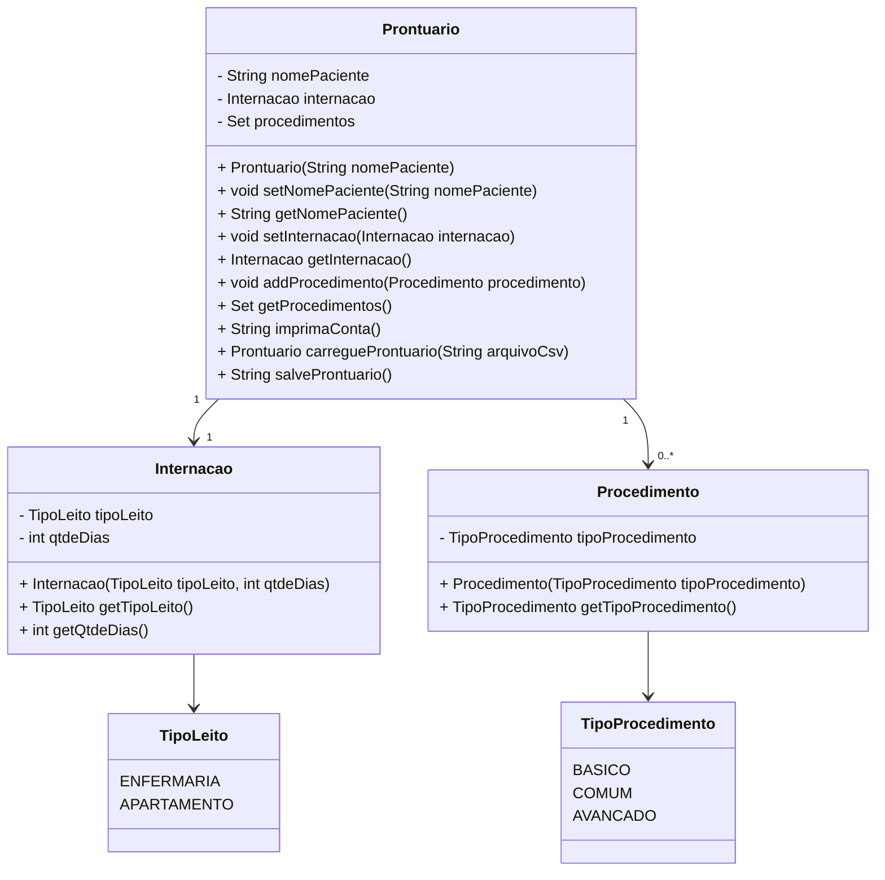

```mermaid

classDiagram
    class Prontuario {
        - String nomePaciente
        - Internacao internacao
        - Set<Procedimento> procedimentos
        + Prontuario(String nomePaciente)
        + void setNomePaciente(String nomePaciente)
        + String getNomePaciente()
        + void setInternacao(Internacao internacao)
        + Internacao getInternacao()
        + void addProcedimento(Procedimento procedimento)
        + Set<Procedimento> getProcedimentos()
        + String imprimaConta()
        + Prontuario carregueProntuario(String arquivoCsv)
        + String salveProntuario()
    }

    class Procedimento {
        - TipoProcedimento tipoProcedimento
        + Procedimento(TipoProcedimento tipoProcedimento)
        + TipoProcedimento getTipoProcedimento()
    }

    class Internacao {
        - TipoLeito tipoLeito
        - int qtdeDias
        + Internacao(TipoLeito tipoLeito, int qtdeDias)
        + TipoLeito getTipoLeito()
        + int getQtdeDias()
    }

    class TipoProcedimento {
        BASICO
        COMUM
        AVANCADO
    }

    class TipoLeito {
        ENFERMARIA
        APARTAMENTO
    }

    Prontuario "1" --> "1" Internacao
    Prontuario "1" --> "0..*" Procedimento
    Procedimento --> TipoProcedimento
    Internacao --> TipoLeito
```